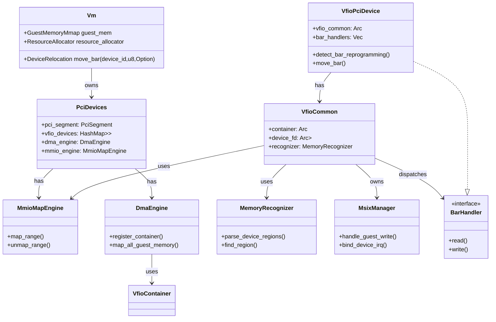

# Firecracker VFIO 直通设计（细化版）

## 概览
此文档在原始 `firecracker vfio直通设计.md` 的基础上，细化 `keyPoints2structure` 小节，明确模块、接口、生命周期与实现要点，便于把设计直接映射到 `src/vmm/src` 下的 Rust 代码。

## 目标
- 提供清晰的模块边界与职责划分
- 给出关键类型/接口与重要方法签名（Rust 风格）
- 描述资源生命周期和并发约束
- 提供可直接翻译为实现的类图（Mermaid）

## 总体模块划分（简要）
- `MemoryRecognizer`：解析 VFIO device 的 IOVA/region，并将每个 region 标记为类型（ECAM、BAR_REG、MSIX_CTRL、MSIX_TABLE、PBA、MMIO_MEM、DISCARD）。
- `VfioCommon`：持有 VFIO 文件描述符（容器/组/设备），并作为各个子模块的工厂/协调者，负责锁策略与并发边界。
- `MmioMapEngine`：统一对 KVM 做 MMIO iova->GPA 的直通映射；负责调用 KVM/vfio 的 map/unmap API，并维护已映射区表。
- `DmaEngine`：统一调用 `vfio_container.vfio_dma_map`，在 Guest memory 变化（热插拔、virtio-mem）时重新挂载 DMA region。
- `MsixManager`：负责 MSIX 表的拦截、向量绑定、eventfd <-> vfio <-> kvm 链接管理。
- `VfioPciDevice`：顶层设备对象，组合 `VfioCommon`、`MsixManager`、BAR 处理逻辑、和必要的设备特化逻辑。

Note: 所有 BAR / ECAM 相关的访问路径都会经过 `VfioCommon`，因此 `MsixManager` 建议由 `VfioCommon` 持有并通过其调用，避免重复持有 VFIO device fd 或并发访问。

## 关键数据结构与接口（Rust 风格）

MemoryRecognizer:
- enum IovaType { Ecam, BarReg {index: u8}, MsixCtrl, MsixTable, Pba, MmioMem, Discard }
- struct RegionInfo { iova: u64, len: u64, typ: IovaType }
- trait MemoryRecognizer { fn parse_device_regions(vfio_dev: &VfioDeviceFd) -> Vec<RegionInfo>; fn find_region(&self, gpa: u64) -> Option<(RegionInfo, u64)> }

VfioCommon:
- struct VfioCommon { container: Arc<VfioContainer>, group_fd: Arc<Mutex<VfioGroupFd>>, device_fd: Arc<Mutex<VfioDeviceFd>>, recognizer: Box<dyn MemoryRecognizer>, mmio_engine: Arc<Mutex<MmioMapEngine>>, dma_engine: Arc<Mutex<DmaEngine>> }
- impl VfioCommon {
    fn new(container: Arc<VfioContainer>, device_fd: VfioDeviceFd, recognizer: Box<dyn MemoryRecognizer>, mmio_engine: Arc<Mutex<MmioMapEngine>>, dma_engine: Arc<Mutex<DmaEngine>> ) -> Self;
    fn lock_device<T, F: FnOnce(&mut VfioDeviceFd) -> T>(&self, op: F) -> T;
}

MmioMapEngine:
- struct MmioMapEntry { iova: u64, len: u64, bar_index: Option<u8>, gpa: u64 }
- struct MmioMapEngine { mapped: HashMap<u64, MmioMapEntry> }
- impl MmioMapEngine {
    fn map_range(&mut self, container: &VfioContainer, iova: u64, len: u64, gpa: u64) -> Result<()>;
    fn unmap_range(&mut self, container: &VfioContainer, iova: u64, len: u64) -> Result<()>;
    fn is_mapped(&self, iova: u64, len: u64) -> bool;
}

DmaEngine:
- struct DmaEngine { container: Arc<VfioContainer>, mapped_guest_regions: Vec<(u64, u64)> }
- impl DmaEngine {
    fn register_container(&mut self, container: Arc<VfioContainer>);
    fn map_all_guest_memory(&mut self, guest_mem: &GuestMemoryMmap) -> Result<()>; // 遍历guest memory并调用vfio_dma_map
    fn unmap_all(&mut self) -> Result<()>;
}

MsixManager:
- struct MsixEntry { vector: u32, gsi: Option<u32>, eventfd: Option<RawFd>, enabled: bool }
- struct MsixManager { table_iova: u64, table_len: u64, pba_iova: u64, entries: Vec<MsixEntry> }
- impl MsixManager {
    fn handle_guest_write(&mut self, offset: u64, data: &[u8]) -> Result<()>; // 当guest写msix table时绑定GSI
    fn bind_device_irq(&self, vfio_dev: &VfioDeviceFd, entry: &MsixEntry) -> Result<()>; // 调VFIO和KVM链接eventfd<->GSI
}

VfioPciDevice (顶层):
- struct VfioPciDevice { vfio_common: Arc<VfioCommon>, bar_handlers: Vec<Box<dyn BarHandler>>, pci_bdf: PciBdf }
- trait BarHandler { fn read(&mut self, offset: u64, data: &mut [u8]); fn write(&mut self, offset: u64, data: &[u8]); }
- impl VfioPciDevice {
    fn new(...)->Result<Self>;
    fn detect_bar_reprogramming(&mut self, bar_index: u8, new_gpa: Option<u64>) -> Result<()>; // 被Vm::DeviceRelocation回调
    fn move_bar(&mut self, bar_index: u8, new_gpa: Option<u64>) -> Result<()>; // 调用MmioMapEngine做map/unmap
    fn handle_mmio_exit(&mut self, gpa: u64, is_write: bool, data: &mut [u8]) -> Result<()>; // PciBus在VM Exit时转发
}

## 设备与 VM / PciBus 集成点（接口）
- 在 `PciDevices::attach_pci_vfio_device` 创建 `VfioPciDevice` 并注册到 `PciSegment`（让 PciBus 在 config-space 或 BAR 的 VM Exit 时把调用路由到该对象）。
- 需要 `Vm` 或 `PciSegment` 提供 `DeviceRelocation` 接口：
  trait DeviceRelocation { fn move_bar(&self, device_id: u32, bar_index: u8, new_addr: Option<GuestAddress>) -> Result<()> }
- `VfioPciDevice::move_bar` 将调用 `VfioCommon.mmio_engine.map_range` 或 `unmap_range`；并在必要时调整 `MsixManager` 或 DMA 映射。

## 并发与锁策略
- 所有 VFIO FD（container/device/group）通过 `Arc<Mutex<...>>` 持有，外部不直接持有 device FD；仅能通过 `VfioCommon::lock_device` 访问，避免不同子模块同时操作 device fd 导致 race。
- `MmioMapEngine` 与 `DmaEngine` 为全局资源（由 `PciDevices` 或 `Vm` 持有），对其操作需在 `VfioCommon` 内或在持有 container 的上下文中进行协同调用，避免重复 map/unmap。推荐 `PciDevices` 在 attach 设备时把 `container` 注册到 `DmaEngine`。

## 生命周期与时序要点
1. Guest 启动前 attach device：
   - 权限校验（host vfio group 是否可访问）
   - `MemoryRecognizer::parse_device_regions` 得到 region 列表
   - 预分配 GPA（若 device 要直通到 guest MMIO，使用 resource_allocator 分配 mmio64）
   - `MmioMapEngine::map_range` 在 guest 访问该 iova 对应 gpa 前完成（尽量）。
   - `DmaEngine.map_all_guest_memory` 将 guest memory 全部挂载到 container（如果 device 需要 DMA）。
   - Msix: 调 VFIO 绑定设备中断到 eventfd，再调 KVM 把 eventfd 绑定到 GSI。

2. Guest 启动后 VM Exit（访问 MMIO / MSIX） 时：
   - PciBus 将 VM Exit 转发到注册的 `VfioPciDevice::handle_mmio_exit`。
   - `VfioPciDevice` 调用 `MemoryRecognizer::find_region` 判断访问类型并分派到对应 `BarHandler` 或 `MsixManager`。
   - 若 guest 写 reprogramming 寄存器（改变 BAR 地址），触发 `detect_bar_reprogramming` -> `Vm::DeviceRelocation::move_bar` -> `VfioPciDevice::move_bar` -> 调用 `MmioMapEngine` 更新映射。

3. Guest 关机或 device 删除：
   - `MsixManager` 取消 eventfd 路由，`DmaEngine` unmap，`MmioMapEngine` unmap 所有 range，最后释放 VFIO fds。

## 监控 Guest memory 变化（heatplug / virtio-mem）
- 在所有会改变 guest memory 的路径（virtio-mem attach、hotplug）添加钩子，使 `DmaEngine` 能被回调并重新执行 `vfio_dma_map`。该回调由 `Vm` 或 `DeviceManager` 在相应操作完成时触发。

## 错误处理与回滚
- `MmioMapEngine::map_range`/`DmaEngine::map_all_guest_memory` 应在失败时能回滚已做的部分映射并返回明确错误类型（例如 `VfioMapError::PermissionDenied`, `VfioMapError::AlreadyMapped`）。

## 测试点与验证步骤
- 单元：MemoryRecognizer 对常见设备 region 的解析（包括跨 region 访问断言）。
- 集成：在不执行真实 VFIO 调用的条件下，mock `VfioContainer`/`VfioDeviceFd`，校验 `MmioMapEngine` 与 `DmaEngine` 在 attach/移除/guest memory 变化时的行为。
- 端到端：在受控的测试机上运行带 NPU 的 VFIO 设备，验证 mmio 直通（无不必要 VM Exit）、MSI/MSIX 正确映射与中断到达 Guest。

## TODO 列表（实现优先级）
- [高] 实现 `MemoryRecognizer`（device region 探测 + 单元测试）。
- [高] 在 `PciDevices` 中添加 `DmaEngine` 管理与 container 注册点。
- [高] 实现 `MmioMapEngine` 并把 `VfioPciDevice::move_bar` 与之对接。
- [中] 实现 `MsixManager` 并添加 eventfd <-> VFIO <-> KVM 链接逻辑。
- [中] 在 `VfioCommon` 中定义统一锁策略并迁移现有 VFIO 访问到该结构。
- [低] 针对 snapshot 与 memory hotplug 的回调与兼容性处理。

---

## 类图（Mermaid）

---

如果你愿意，我可以：
- 把这些接口草稿直接落成 `src/vmm/src/devices/vfio` 下的 Rust trait/struct stub 文件；
- 或者先把 `MemoryRecognizer` 与 `MmioMapEngine` 的单元测试 scaffold 写好以便驱动实现。

结束。
